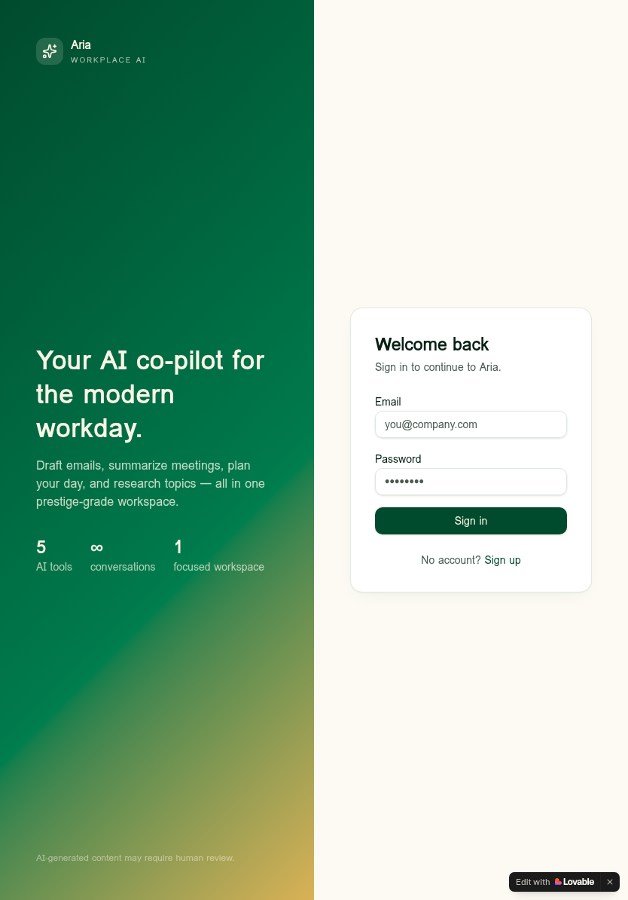

# Aria — AI Workplace Productivity Assistant

Modern SaaS automation for the professional workflow. Aria is a unified
workspace that drafts emails, summarizes meetings, plans your day, and
researches topics — powered by structured prompt engineering and a clean,
prestige-grade UI.



## Live demo

- App: https://ai-workmate-assist.lovable.app

## Features

- **Smart Email Generator** — audience- and tone-aware drafts (professional,
  friendly, persuasive, concise, apologetic, enthusiastic) with length control.
- **Meeting Notes Summarizer** — converts raw notes or transcripts into a
  structured summary with key points, decisions, action items, and deadlines.
- **AI Task Planner** — Eisenhower-style prioritization plus a realistic
  schedule for today, this week, or this sprint.
- **AI Research Assistant** — executive summary, key insights, trade-offs, and
  recommended next steps for any topic.
- **AI Chat** — multi-thread conversational assistant with cloud-saved history.
- **Persistent outputs** — every generation is saved to your account and
  surfaced on the dashboard.

## Tech stack

- **Frontend:** React 19, TanStack Start v1, TanStack Router, Tailwind CSS v4,
  shadcn/ui, Vite 7
- **Backend:** TanStack server functions (`createServerFn`) running on
  Cloudflare Workers (edge runtime)
- **Auth & Database:** Lovable Cloud (Supabase) with Row-Level Security
- **AI:** Lovable AI Gateway via the Vercel AI SDK
  (default model: `google/gemini-3-flash-preview`)

## Getting started

```bash
bun install
bun run dev
```

Then open the URL printed in the terminal. Sign up to create an account and
start using the tools.

## Project structure

```
src/
  components/        AppShell, OutputCard, shadcn/ui primitives
  hooks/             use-auth, use-mobile
  integrations/      Supabase clients (browser, server, admin)
  lib/               ai-gateway, ai-features.functions (server fns)
  routes/
    _authenticated/  Dashboard, Email, Meeting, Tasks, Research, Chat
    api/             Streaming chat endpoint
    login.tsx        Sign-in / sign-up
supabase/migrations  Database schema (chat_threads, chat_messages,
                     generated_outputs) with RLS policies
```

## Disclaimer

AI-generated content may require human review.